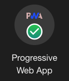

# React Weather PWA

### Table of Contents
- [React Weather PWA](#react-weather-pwa)
    - [Table of Contents](#table-of-contents)
  - [Overview and goal](#overview-and-goal)
    - [View the app HERE!](#view-the-app-here)
  - [Features](#features)
  - [Technologies Used](#technologies-used)
  - [Instructions for running project](#instructions-for-running-project)
  - [Want to contribute?](#want-to-contribute)
          - [This project was created by Ashish Malla](#this-project-was-created-by-ashish-malla)
          - [2021/05/26](#20210526)

## Overview and goal
### View the app [HERE!](https://happy-almeida-f62824.netlify.app/)
<table>
  <td>
    
  </td>
  <td>
    
  </td>
  <td>
    
  </td>
  <td>
    
  </td>
</table>
Fully responsive Progressive Web App that let's user search weather by a city name using openweathermap's API. Main goal of this project is so I could practice making Progressive Web App in React. 

## Features 
User can search current and forecast weather by a city name using openweathermap's API. Users also has an option to convert °F to °C and vice versa.

## Technologies Used
- React
- Html
- CSS
- JavaScript
- OpenWeatherMap's API

## Instructions for running project
1. Clone this [repository.](https://github.com/asiisii/WeatherApp-React)
2. `cd` into the repository in your terminal
3. Then `npm i` to install required dependencies
4. Then `npm start` in your terminal to view it on your browser at `localhost:3000`

## Want to contribute?
If you'd like to contribute, please fork this repository and clone it down to your local machine. Create a new branch. Once you've successfully implemented the changes in code for your intended contribution without changing any of the current functionality of main, contact the authors to review the changes.

**************************************************************************
###### This project was created by [Ashish Malla](https://github.com/asiisii)
###### 2021/05/26
**[Back to top](#table-of-contents)**

